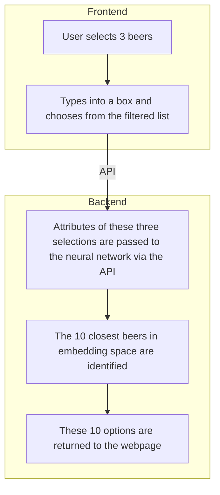

# Beer Recommender System

This repository contains the code for a beer recommender system. The system uses a dataset of beer reviews to generate recommendations based on similarity in the embedding space.

## Flow Diagram


## Project Structure

The project has the following structure:
```bash
├── data 
│ ├── raw 
│ │ └── beer_data.csv 
│ └── processed 
│ └── beer_vectors.pkl 
├── notebooks 
│ └── data_exploration.ipynb 
├── src 
│ ├── init.py 
│ ├── data_processing.py 
│ ├── model.py 
│ ├── utils.py 
│ └── visualizations 
│ │ └── plot_embeddings.py 
├── tests 
│ ├── init.py 
│ ├── test_data_processing.py 
│ └── test_model.py 
├── figures 
├── .gitignore 
└── pyproject.toml
```

## Installation

This project uses [Poetry](https://python-poetry.org/) for dependency management. To install the dependencies, first install Poetry:

```bash
curl -sSL https://install.python-poetry.org | python -
```

Then, navigate to the project directory and install the dependencies:

```
cd beer-recommender
poetry install
```

## Usage
To generate beer recommendations, run the following command:

```
poetry run python src/visualizations/plot_embeddings.py
```

To generate visualizations of the beer embeddings, run the following command:

```
poetry run python src/visualizations/plot_embeddings.py
```

## Testing
To run the tests, use the following command:

```
poetry run pytest
```

